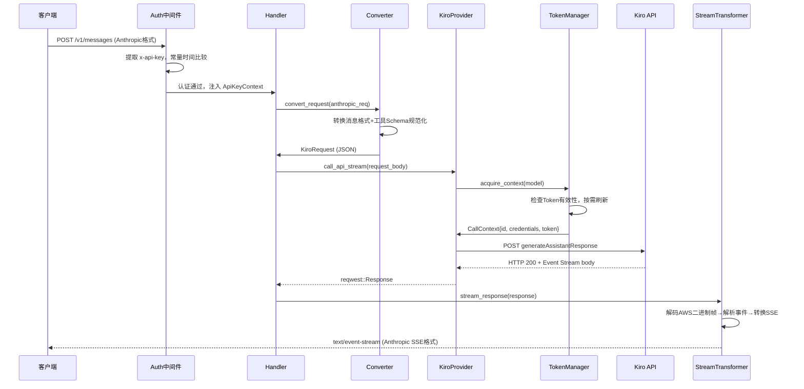
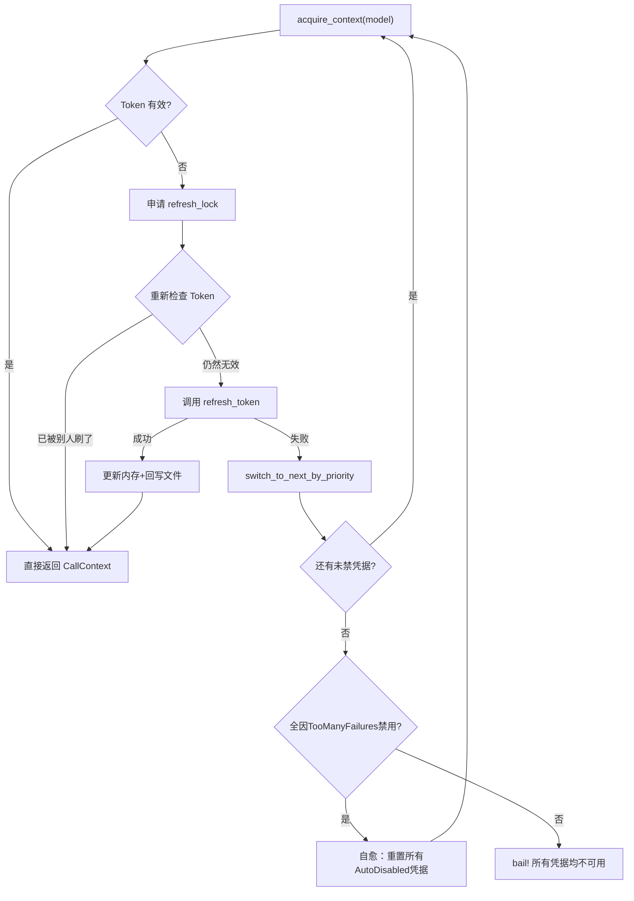

> **注：** 本文档由 **claude-sonnet-4-6** 模型自动生成。

# 📖 kiro2cc-proxy-local 源码全景解析

## 🌟 小白导读

**一句话大白话：** 这个项目就像一个"翻译官+接线员"，帮你把发给 Claude（Anthropic API）的请求，偷偷转手翻译成 Kiro IDE（AWS CodeWhisperer）能听懂的话，再把回答翻译回来——让你用 Claude 的 API 密钥调用 Kiro 后端的 AI 能力，甚至能同时管理多个 Kiro 账号、自动切换、自动续签 Token。

**生活类比：** 想象你去一家日本餐厅，但你只会说中文。这个项目就是站在门口的翻译员：你（Claude 客户端）用中文（Anthropic API 格式）点菜，翻译员把菜单翻译成日文（Kiro API 格式）给厨师，厨师做好了翻译员再把菜名翻译成中文端给你——你全程感知不到语言切换。更厉害的是，这个翻译员还管理着一组餐厅会员卡（多凭据），会员卡快过期了自动续，某张卡被冻结了自动换另一张。

**读前预期：**
- 读完"架构全景"后，你将能理解：为什么需要协议转换层，以及请求从进来到出去经历了哪几个组件
- 读完"核心源码剥洋葱"后，你将能看懂：Token 双重检查锁定、AWS Event Stream 二进制解码、Kiro→Anthropic SSE 转换
- 读完"难点突破"后，你将彻底搞清楚：指数退避抖动算法、thinking 标签的"假结束"检测、凭据自愈机制
- 读完"两种负载均衡模式详解"后，你将完整理解：priority 粘性调度与 balanced Round-Robin 的选凭据逻辑、失败处理差异、429 的特殊处理悖论

---

## 📋 目录
- [项目概述与技术栈](#项目概述与技术栈)
- [目录结构](#目录结构)
- [架构全景（附生活类比）](#架构全景附生活类比)
- [入口与初始化流程](#入口与初始化流程)
- [关键业务流程图解](#关键业务流程图解)
- [核心源码剥洋葱（三层深度）](#核心源码剥洋葱三层深度)
- [错误处理与安全边界](#错误处理与安全边界)
- [关键类型与接口定义](#关键类型与接口定义)
- [难点突破（逐个攻克）](#难点突破逐个攻克)
- [两种负载均衡模式详解](#两种负载均衡模式详解)
- [为什么要这样设计？](#为什么要这样设计)
- [避坑指南](#避坑指南)

---

## 🎯 项目概述与技术栈

**kiro2cc-proxy-local** 是一个高性能 Anthropic API 兼容代理，将 Anthropic `POST /v1/messages` 请求转换为 AWS Kiro（CodeWhisperer）API 格式并转发，令任何支持 Anthropic SDK 的客户端（如 Claude Code、Cursor）可以透明地使用 Kiro 后端算力。核心价值：支持多账号管理、自动 Token 刷新、故障转移、负载均衡。

**技术栈：**

| 技术/库 | 版本 | 在本项目中的具体角色 |
|---|---|---|
| Rust (edition 2024) | — | 系统语言，零开销抽象，内存安全 |
| tokio | 1.x | 异步运行时，驱动所有 async 请求处理 |
| axum | 0.8 | HTTP 框架，注册路由、中间件、提取器 |
| reqwest | 0.12 | 向上游 Kiro API 发起 HTTP 请求，支持流式响应 |
| serde/serde_json | 1.x | JSON 序列化/反序列化，协议转换核心工具 |
| parking_lot | 0.12 | 高性能同步原语，替代标准库 Mutex/RwLock |
| sha2 / hex | — | 由 refreshToken 派生 machineId 指纹 |
| subtle | 2.6 | 常量时间字符串比较，防止时序攻击 |
| rust-embed | 8 | 将 admin-ui/dist 和 user-ui/dist 嵌入二进制 |
| chrono | 0.4 | RFC3339 Token 过期时间解析与比较 |
| bytes / futures | — | 流式响应的字节缓冲与异步 Stream 组合 |
| clap | 4.5 | 命令行参数解析（--config, --credentials） |

**核心特性：**
- **双协议转换**：Anthropic Messages API ↔ AWS CodeWhisperer Streaming API
- **多凭据管理**：固定优先级 + Round-Robin 两种负载均衡策略，自动故障转移
- **双认证模式**：Social OAuth (Kiro) 和 IdC/AWS SSO OIDC 两种 Token 刷新路径
- **Admin 控制面板**：REST API + 内嵌 Vue SPA 管理凭据、查看 RPM、追踪用量
- **双 AI 流端点**：`/v1/messages`（标准 SSE）和 `/cc/v1/messages`（Claude Code 特供，等待 contextUsageEvent）

---

## 📂 目录结构

```
kiro2cc-proxy-local/
  ├─ src/
  │   ├─ main.rs                  # 入口：解析CLI、加载配置/凭据、组装 axum Router
  │   ├─ anthropic/               # Anthropic 兼容层（对外暴露 /v1 接口）
  │   │   ├─ router.rs            # 路由注册：/v1/models, /v1/messages 等
  │   │   ├─ middleware.rs        # Auth 中间件、AppState（共享状态容器）
  │   │   ├─ handlers.rs          # HTTP handler 函数，协调转换+请求
  │   │   ├─ converter.rs         # Anthropic → Kiro 请求格式转换（最复杂的模块）
  │   │   ├─ stream.rs            # Kiro Event Stream → Anthropic SSE 转换
  │   │   ├─ types.rs             # Anthropic API 类型定义
  │   │   └─ websearch.rs         # WebSearch MCP 工具调用适配
  │   ├─ kiro/                    # Kiro API 客户端
  │   │   ├─ token_manager.rs     # Token 管理：自动刷新、多凭据故障转移
  │   │   ├─ provider.rs          # HTTP 客户端：重试、退避、并发控制
  │   │   ├─ machine_id.rs        # 设备指纹生成（SHA256 from refreshToken）
  │   │   ├─ parser/              # AWS Event Stream 二进制帧解码器
  │   │   └─ model/               # Kiro API 数据类型定义
  │   ├─ admin/                   # Admin REST API（凭据管理、RPM 查询）
  │   ├─ admin_ui/                # 内嵌 Admin SPA（rust-embed）
  │   ├─ model/                   # 通用数据模型
  │   │   ├─ config.rs            # Config 结构体，从 config.json 加载
  │   │   ├─ rpm.rs               # 滑动窗口 RPM 追踪器
  │   │   ├─ api_key.rs           # 子 API Key 管理
  │   │   └─ usage.rs             # 用量/费用追踪
  │   ├─ cache.rs                 # Prompt Cache 模拟（虚报 cache_read_input_tokens）
  │   ├─ token.rs                 # count_tokens 外部 API 适配
  │   ├─ http_client.rs           # reqwest Client 工厂（代理配置、TLS 后端）
  │   └─ common/auth.rs           # API Key 提取与常量时间比较
  ├─ admin-ui/                    # Vue 3 Admin 面板源码（Vite + Tailwind）
  ├─ user-ui/                     # Vue 3 User 面板源码
  ├─ config.example.json          # 配置文件模板
  └─ Cargo.toml                   # 依赖声明
```

---

## 🏗️ 架构全景（附生活类比）

### 核心类/模块 1：`MultiTokenManager`（多凭据 Token 管理器）

**🗣️ 第一层 — 大白话**
- **它是啥**：持有一组 Kiro OAuth 凭据，按需刷新 access_token，并根据策略选择当前活跃凭据
- **通俗点说**：就像手机里存了多张银行卡的移动支付 App，付款时自动挑一张余额充足的刷，刷失败了切到下一张，快过期了自动续费
- **没有它会怎样**：只能用单凭据，Token 过期后请求报 401，需要用户手动重启服务

**🔧 第二层 — 技术原理**
- **设计模式**：状态机 + 双重检查锁定（Double-Checked Locking）
- **为什么不直接锁**：刷新 Token 是网络 I/O（可能耗时数秒），如果每次都持锁，并发请求全部排队——CPU 空转、延迟爆炸。DCL 让 99% 的请求零等待直接拿缓存 Token
- **两种调度策略**：
  - `priority` 模式（默认）：粘性使用 `current_id` 指向的最高优先级凭据，失败才切换
  - `balanced` 模式：每次请求都通过 `AtomicU64` 计数器做 Round-Robin，均匀轮转所有可用凭据
- **数据流链路**：`acquire_context(model)` → 按模式选择凭据 → 检查 Token 有效性 → (可选)加 refresh_lock 刷新 → 返回 `CallContext`

**🔬 第三层 — 实现细节**
- **文件位置**：`src/kiro/token_manager.rs:906`

```rust
// 第一次检查（无锁）：快速判断是否需要刷新
let needs_refresh = is_token_expired(credentials) || is_token_expiring_soon(credentials);

let creds = if needs_refresh {
    // 获取刷新锁：同一时间只有一个协程进入刷新逻辑
    let _guard = self.refresh_lock.lock().await;   // tokio异步锁，不阻塞线程

    // 第二次检查：获取锁后重新读最新凭据（其他请求可能已刷新）
    let current_creds = { /* 重新从 entries 读取 */ };

    if is_token_expired(&current_creds) || is_token_expiring_soon(&current_creds) {
        let new_creds = refresh_token(&current_creds, &self.config, ...).await?; // 真正刷新
        // 更新内存 + 回写文件
        Ok(new_creds)
    } else {
        Ok(current_creds)  // 别人已经刷好了，直接用
    }
} else {
    Ok(credentials.clone())  // 快速路径：Token 有效，直接返回
};
```

> ⚠️ **常见误区**：只做一次检查会导致"惊群效应"——100 个并发请求同时发现 Token 过期，同时发起 100 次刷新请求，直接打爆上游 OAuth 服务。DCL 确保只有一次真实刷新。

---

### 核心类/模块 2：`KiroProvider`（API 请求执行器）

**🗣️ 第一层 — 大白话**
- **它是啥**：实际发 HTTP 请求给 Kiro 上游的组件，内含重试逻辑和并发控制
- **通俗点说**：是快递员，知道该去哪个仓库（哪个凭据的 API endpoint），包裹送丢了（网络错误）会重试，如果是地址写错了（400）不重试直接报错，如果是配送员证件过期（401）就换配送员
- **没有它会怎样**：单次请求失败就报错给用户，没有容灾能力

**🔧 第二层 — 技术原理**
- **设计模式**：策略模式（HTTP 错误码分类决策表） + 信号量（并发控制）
- **错误码决策逻辑**：

| 状态码 | 含义 | 策略 |
|---|---|---|
| 400 | 请求格式错误 | 直接返回，不重试不切换（格式问题重试无意义） |
| 401/403 | 凭据/权限问题 | 计入失败次数，超阈值禁用该凭据并切换 |
| 402+MONTHLY | 月度额度用尽 | 永久禁用该凭据，切换到下一个 |
| 429 | 限流 | 不禁用凭据，递增 success_count 触发轮转 |
| 408/5xx | 上游瞬态错误 | 指数退避重试，不切换凭据 |
| 网络错误 | 链路问题 | 指数退避重试，不切换（防止网络抖动误禁凭据） |

**🔬 第三层 — 实现细节**
- **文件位置**：`src/kiro/provider.rs:291`

```rust
// 信号量控制：最多 50 个并发请求发往上游
let _permit = self.concurrency_limit.acquire().await?;
// 总重试次数 = min(凭据数×3, 9)，防止无限重试
let max_retries = (total_credentials * MAX_RETRIES_PER_CREDENTIAL).min(MAX_TOTAL_RETRIES);

for attempt in 0..max_retries {
    let ctx = self.token_manager.acquire_context(model.as_deref()).await?;
    // ... 发送请求 ...
    if status.is_success() {
        self.token_manager.report_success(ctx.id); // 更新统计
        return Ok(response);
    }
    // 按错误码决策是否切换/禁用凭据
}
```

> ⚠️ **常见误区**：429 不能计入 `report_failure`（凭据本身没问题，是被限流了），应该用 `report_success` 让 balanced 模式的计数器增加，自然轮到下一个凭据。

---

### 核心类/模块 3：`AppState`（应用共享状态）

**🗣️ 第一层 — 大白话**
- **它是啥**：axum 的全局共享数据容器，每个请求 handler 都能访问
- **通俗点说**：相当于饭店的"总服务台"，存放了所有服务员都需要用的东西：API 密钥、AI 引擎（KiroProvider）、账本（UsageTracker）、流量监控（RpmTracker）
- **没有它会怎样**：每次请求都要重新创建这些对象，性能崩溃

**🔧 第二层 — 技术原理**
- **设计模式**：Builder 模式（链式 `with_*` 方法）+ Arc 共享所有权
- **为什么 api_key 用 `Arc<RwLock<String>>` 而不是直接 `String`**：Admin API 支持运行时更新 api_key，需要可变共享——`RwLock` 允许多读单写，`Arc` 跨线程共享

**🔬 第三层 — 实现细节**
- **文件位置**：`src/anthropic/middleware.rs:33`

```rust
pub struct AppState {
    pub api_key: Arc<RwLock<String>>,      // 运行时可变的主 API Key
    pub kiro_provider: Option<Arc<KiroProvider>>, // None = 纯转发模式
    pub api_key_manager: Option<Arc<ApiKeyManager>>, // None = 不启用多用户
    pub usage_tracker: Option<Arc<UsageTracker>>,    // None = 不追踪用量
    pub rpm_tracker: Option<Arc<RpmTracker>>,        // None = 不监控 RPM
}
```

---

## 🚀 入口与初始化流程

`main()` 按以下严格顺序初始化（`src/main.rs`）：

1. **CLI 参数解析**：`Args::parse()` 获取 `--config` 和 `--credentials` 路径
2. **日志初始化**：`tracing_subscriber` + `RUST_LOG` 环境变量控制日志级别
3. **加载 Config**：从 `config.json` 读取 host/port/region/api_key 等
4. **加载凭据**：从 `credentials.json` 读取（单对象或数组格式，自动识别）
5. **创建 `MultiTokenManager`**：为每个凭据分配 ID、生成 machineId、选初始活跃凭据
6. **创建 `KiroProvider`**：包装 token_manager，注入全局代理配置
7. **初始化 `count_tokens` 配置**（可选外部 API）
8. **按条件创建 Admin 组件**：仅当 `admin_api_key` 非空时创建 `ApiKeyManager`、`UsageTracker`
9. **组装 Router**：`anthropic_app` 为基础，按需 nest `/api/admin` 和 `/admin`
10. **启动 TCP 监听**：`tokio::net::TcpListener::bind(host:port)` → `axum::serve`

```rust
// src/main.rs:62-74 —— MultiTokenManager 的创建是最复杂的初始化步骤
let token_manager = MultiTokenManager::new(
    config.clone(),
    credentials_list,     // 按 priority 排序的凭据列表
    proxy_config.clone(), // 全局代理（可被每个凭据的 proxy_url 覆盖）
    Some(credentials_path.into()), // 用于 Token 刷新后回写文件
    is_multiple_format,   // 只有数组格式才回写（防止破坏单对象文件格式）
)
```

**为什么 Admin 组件按条件加载？** 不需要管理功能的简单部署可以零开销启动，`admin_api_key` 为空时完全不加载 ApiKeyManager 和 UsageTracker 的内存结构。

---

## 🗺️ 关键业务流程图解

### 流程一：POST /v1/messages 流式请求完整链路



**👆 流程大白话翻译：**
1. **认证门卫**：中间件先检查 API Key，用常量时间比较防止时序攻击
2. **格式翻译**：Converter 把 Anthropic 的"对话历史+工具定义"翻译成 Kiro 能理解的 JSON 结构
3. **凭据调度**：TokenManager 选好账号、确保 Token 没过期，打包成 CallContext
4. **上游请求**：KiroProvider 带着正确的 AWS 请求头发出去，拿到流式响应
5. **反向翻译**：StreamTransformer 把 Kiro 的 AWS Event Stream 二进制格式实时翻译成 Anthropic SSE

**🔍 这个流程中最难理解的点**：步骤5中的"反向翻译"——Kiro 返回的不是普通的 `text/event-stream`，而是 **AWS Event Stream 二进制帧**（有固定长度前导码、CRC32 校验），需要一个状态机解码器一帧一帧解析，再把每个事件类型映射到 Anthropic SSE 格式。

### 流程二：Token 自动刷新与凭据故障转移



**🔍 自愈机制说明**：当所有凭据都被"自动禁用"（因为连续失败达到阈值）时，系统会把它们全部重新激活——效果等同于重启服务，避免需要人工干预。但"手动禁用"的凭据不会被自愈。

---

## 🔍 核心源码剥洋葱（三层深度）

### 解析一：协议转换——Anthropic → Kiro 格式

**📍 文件位置**：`src/anthropic/converter.rs:1`

**第一层看懂它**：把用户发来的"对话历史 + 工具定义"从 Anthropic 格式翻译成 Kiro 能理解的格式。Kiro API 叫 `generateAssistantResponse`，它的请求结构与 Anthropic 完全不同——历史消息放在 `conversationState.chatHistory`，当前消息放在 `currentMessage.userInputMessage`，工具叫 `toolSpecifications`。

```rust
// src/anthropic/converter.rs 核心逻辑示意
// 💡 Anthropic 请求 → Kiro 请求的整体映射关系
pub fn convert_request(req: &MessagesRequest, ...) -> Result<KiroRequest> {
    // 💡 把 messages 数组按 role 分为"历史"和"当前消息"
    let (history, current) = split_messages(&req.messages);

    // 💡 每条历史消息转为 HistoryUserMessage 或 HistoryAssistantMessage
    let chat_history = build_chat_history(history)?;

    // 💡 工具定义需要规范化 JSON Schema（Kiro 比 Anthropic 更严格）
    let tool_specs = req.tools.as_ref().map(|tools| {
        tools.iter().map(normalize_and_convert_tool).collect()
    });

    // 💡 model 名称需要映射（claude-3-5-sonnet → CLAUDE_3_5_SONNET 等）
    Ok(KiroRequest { conversation_state: ConversationState { chat_history, current_message: current, .. }, tool_specs })
}
```

**第二层搞清楚它**：
- **最复杂的转换**：`normalize_json_schema` — Kiro 不接受 `required: null`、`properties: null`、`anyOf/oneOf/allOf`，必须清洗掉，否则上游返回 400
- **为什么不能直接透传**：两个 API 的设计哲学不同，Anthropic 是"消息数组"（扁平化），Kiro 是"对话状态机"（有明确的当前/历史分层）

**第三层吃透它**：
- **最关键的一处**：`normalize_json_schema_inner` 里的 `anyOf/oneOf/allOf` 被直接丢弃（`src/anthropic/converter.rs:115`），因为 Kiro 侧对组合 Schema 兼容性极差
- **改掉会发生什么**：如果不丢弃 `anyOf`，MCP 工具定义几乎必定触发 Kiro 400 `"Improperly formed request"`
- **底层追踪**：`post_messages handler` → `convert_request` → `normalize_json_schema` → 过滤 null/anyOf → 生成 `toolSpecifications`

---

### 解析二：AWS Event Stream 二进制帧解码

**📍 文件位置**：`src/kiro/parser/decoder.rs:1`

**第一层看懂它**：Kiro 的流式响应不是普通文本 SSE，而是 AWS Event Stream——一种二进制分帧协议，每帧有固定结构：`[总长度4B][头部长度4B][CRC4B][headers][payload][消息CRC4B]`。解码器用状态机处理粘包/半包问题。

```rust
// src/kiro/parser/decoder.rs —— 状态机核心
// 💡 四个状态：Ready/Parsing/Recovering/Stopped
pub enum DecoderState { Ready, Parsing, Recovering, Stopped }

// 💡 feed() 把新数据追加进缓冲区
pub fn feed(&mut self, data: &[u8]) -> ParseResult<()> {
    if self.buffer.len() + data.len() > self.max_buffer_size { bail!("缓冲区溢出") }
    self.buffer.extend_from_slice(data);  // 追加到 BytesMut
    self.state = DecoderState::Parsing;
    Ok(())
}

// 💡 decode_iter() 循环尝试解析完整帧
pub fn decode_iter(&mut self) -> DecodeIter<'_> { DecodeIter { decoder: self } }

// 💡 每次尝试解析一帧（至少需要 PRELUDE_SIZE=8 字节才能知道帧长度）
fn try_decode_one(&mut self) -> Option<ParseResult<Frame>> {
    if self.buffer.len() < PRELUDE_SIZE { return None; }  // 数据不足，等待更多
    // ...解析帧头，验证 CRC，提取 payload...
}
```

**第二层搞清楚它**：
- **为什么需要 Recovering 状态**：网络传输中偶尔会有单帧损坏，如果直接 `Stopped` 整个流就断了。Recovering 状态会跳过损坏字节，寻找下一个有效帧的起始位置（以 `total_length` 字段特征为定位点），允许流继续
- **底层追踪**：`stream_response handler` → `EventStreamDecoder::feed(chunk)` → `decode_iter()` → `parse_frame()` → CRC32C 校验 → 返回 `Frame`

---

### 解析三：指数退避抖动算法

**📍 文件位置**：`src/kiro/provider.rs:432`

**第一层看懂它**：重试不能立即重试（会打垮上游），也不能等固定时间（所有请求同时重试会造成"惊群"）。指数退避 + 抖动就像"等一会儿"——等的时间按指数增长，加一点随机性让不同请求错开。

```rust
fn retry_delay(attempt: usize) -> Duration {
    const BASE_MS: u64 = 200;    // 💡 基础等待 200ms
    const MAX_MS: u64 = 5_000;   // 💡 最长等 5 秒

    // 💡 指数增长：200, 400, 800, 1600, 3200, 5000(cap)
    let exp = BASE_MS.saturating_mul(2u64.saturating_pow(attempt.min(6) as u32));
    let backoff = exp.min(MAX_MS);

    // 💡 抖动范围 = backoff 的 25%，随机加进去
    let jitter_max = (backoff / 4).max(1);
    let jitter = fastrand::u64(0..=jitter_max);  // 轻量级随机，无需加密强度
    Duration::from_millis(backoff.saturating_add(jitter))
}
```

**第三层吃透它**：
- **`saturating_mul` / `saturating_pow`**：防止整数溢出（attempt=100 时 2^100 爆炸），让极大值安全截断到 `u64::MAX`
- **为什么 jitter 用 25% 而不是 50%**：jitter 过大会让短请求等太久，25% 是业界常见折衷

---

## 🛡️ 错误处理与安全边界

### 错误处理策略

**整体原则**：错误在最近的层处理，不向上冒泡的是"已知可恢复错误"（用 `tracing::warn` 记录），向上冒泡的是"不可恢复错误"（由 handler 转换为 HTTP 4xx/5xx 响应）。

```rust
// src/anthropic/handlers.rs —— Provider 错误到 HTTP 响应的映射
fn map_provider_error(err: Error) -> Response {
    let msg = err.to_string();
    // 💡 400 转发给客户端，不掩盖真实原因
    if msg.contains("400") || msg.contains("Bad Request") {
        return (StatusCode::BAD_REQUEST, Json(ErrorResponse::new("api_error", msg))).into_response();
    }
    // 💡 所有凭据耗尽 → 503 Service Unavailable
    if msg.contains("所有凭据") || msg.contains("额度已用尽") {
        return (StatusCode::SERVICE_UNAVAILABLE, ...).into_response();
    }
    // 💡 其他上游错误 → 502 Bad Gateway（代理的经典语义）
    (StatusCode::BAD_GATEWAY, ...).into_response()
}
```

**错误层级**：

| 层级 | 错误类型 | 处理方式 |
|---|---|---|
| Token 刷新失败 | anyhow::Error | 切换凭据重试，记录 warn |
| 上游 API 失败 | HTTP 状态码 | 按决策表路由：重试/切换/直接返回 |
| 协议转换错误 | ConversionError | 直接返回 400，不重试 |
| 凭据全灭 | bail! | 返回 503 给客户端 |
| 配置加载失败 | process::exit(1) | 启动阶段直接退出 |

### 边界输入校验

- **API Key**：在中间件层 `auth_middleware` 校验，未通过直接 401，不进入 handler
- **refreshToken 截断检测**：`validate_refresh_token` 检查长度 < 100 或包含 `"..."` 立即 bail（`src/kiro/token_manager.rs:124`）——Kiro IDE 有时会故意截断凭证防止第三方使用
- **JSON Schema 清洗**：`normalize_json_schema` 在协议转换阶段清洗工具 Schema，防止非法结构传递到上游
- **请求体大小限制**：`DefaultBodyLimit::max(200MB)`，防止超大请求体打爆内存

### 安全相关逻辑

- **常量时间比较**：`common/auth.rs` 使用 `subtle` crate 的 `ConstantTimeEq`，防止通过响应时间差猜 API Key
- **refreshToken 哈希**：Admin API 返回凭据时只暴露 `refresh_token_hash`（SHA-256），不暴露明文
- **x-amzn-codewhisperer-optout: true**：请求头声明不希望训练数据被 AWS 收集

---

## 📐 关键类型与接口定义

```rust
// src/kiro/token_manager.rs:556 —— API 调用上下文，确保并发请求使用一致的凭据
pub struct CallContext {
    pub id: u64,                    // 凭据唯一 ID（用于 report_success/failure）
    pub credentials: KiroCredentials, // 含 proxy_url、region 等凭据级配置
    pub token: String,              // 有效的 access_token
}
```

| 概念/类型名 | 文件位置 | 在业务中代表什么 |
|---|---|---|
| `KiroCredentials` | `src/kiro/model/credentials.rs:14` | 一个 Kiro 账号的完整凭据（token + 配置） |
| `CredentialsConfig` | `src/kiro/model/credentials.rs:111` | 凭据文件内容（自动识别单对象/数组格式） |
| `CallContext` | `src/kiro/token_manager.rs:556` | 一次 API 调用的"通行证"，绑定了账号+Token |
| `DisabledReason` | `src/kiro/token_manager.rs:455` | 区分手动禁用 vs 自动禁用，决定能否自愈 |
| `AppState` | `src/anthropic/middleware.rs:33` | axum 共享状态，所有 handler 的依赖注入容器 |
| `Config` | `src/model/config.rs:17` | 从 config.json 加载的全局配置 |
| `RpmSnapshot` | `src/model/rpm.rs:58` | 当前 60 秒内三维度 RPM 统计快照 |
| `CredentialEntrySnapshot` | `src/kiro/token_manager.rs:479` | Admin API 返回的凭据状态（不含敏感字段） |

---

## 🧩 难点突破（逐个攻克）

### 难点 1：双重检查锁定（DCL）的必要性与正确性

**🤔 难在哪里**：Token 刷新是异步 I/O，如果每次持有互斥锁再刷新，并发 50 个请求全部排队等待 1-2 秒的 OAuth 调用——实际上大多数时候 Token 根本没过期，锁是白拿的。

**💡 心智模型**：
像高速公路收费站：大多数时候车辆（请求）直接通过（Token 有效），不需要检票（加锁）。只有收费系统报警（Token 过期）时才需要停车排队检查。但收费人员（goroutine）进检查间（refresh_lock）前还要再看一眼——因为前一辆车可能已经把系统修好了（另一个请求刷新了 Token）。

**🔗 实现追踪**：
```
acquire_context()
  └─ is_token_expired() 第一次无锁检查
      └─ [过期时] refresh_lock.lock().await  ← tokio 异步锁，不阻塞 OS 线程
          └─ 重新 entries.lock() 读最新凭据
              └─ is_token_expired() 第二次检查（持锁）
                  └─ [仍过期] refresh_token()  ← 真正的网络 I/O
                      └─ entries.lock() 更新凭据
```

**⚠️ 常见陷阱**：
- 陷阱1：把 `parking_lot::Mutex` 和 `tokio::sync::Mutex` 搞混。entries 用 `parking_lot::Mutex`（同步，持锁时间极短），refresh_lock 用 `tokio::sync::Mutex`（异步，持锁时间可能很长）——在异步代码中持有同步锁会在 `.await` 处 panic
- 陷阱2：第二次检查必须重新从 `entries` 读取凭据，不能复用第一次检查前的 `credentials` 变量——第一次检查到第二次检查之间，`entries` 里的数据可能已经被更新

**✅ 正确姿势**：
```rust
// 异步刷新锁用 tokio::sync::Mutex
let _guard = self.refresh_lock.lock().await;  // 不阻塞线程
// 获取锁后必须重新读数据
let current_creds = { let entries = self.entries.lock(); entries.iter().find(|e| e.id == id)... };
```

---

### 难点 2：thinking 标签"假结束"检测

**🤔 难在哪里**：Kiro 的流式响应在 thinking 块中可能包含 `</thinking>` 字符串——这是模型在**思考过程中**提到标签本身（如"我需要处理 `</thinking>` 标签"），而不是真正结束思考。如果直接按字符串匹配，会提前截断思考内容。

**💡 心智模型**：
像读书时遇到引号里的句号——`他说："文章结束了。"这句话` 里的句号是引用内容，不是文章真正的结尾。代码需要识别出"这个 `</thinking>` 是被反引号/引号包着的，是引用，不是真正结束"。

**🔗 实现追踪**：
```
stream.rs::find_real_thinking_end_tag(buffer)
  └─ 循环搜索 </thinking>
      └─ 检查前后字节是否是 QUOTE_CHARS（含反引号、引号、各种标点）
          └─ [被包裹] 跳过，继续搜索
          └─ [不被包裹] 检查后面是否有 \n\n（真正结束标签后一定有双换行）
              └─ [有 \n\n] 返回位置
              └─ [没有] 等待更多流数据
```

**⚠️ 常见陷阱**：
- 陷阱1：在缓冲区末尾找到 `</thinking>` 但后面数据不够判断是否有 `\n\n`，应返回 `None` 等待更多数据，而不是返回该位置——否则真正的思考内容会被截断
- 陷阱2：`QUOTE_CHARS` 列表不够全——模型可能用 `#`、`!`、`(` 等各种标点包裹标签，需要穷举

**✅ 正确姿势**：`src/anthropic/stream.rs:63` 的 `find_real_thinking_end_tag` 函数已处理上述所有情况。

---

### 难点 3：machineId 的生成与规范化

**🤔 难在哪里**：Kiro API 要求请求头中包含固定格式的 64 字符十六进制 machineId，但用户配置的 machineId 可能是 UUID 格式（32位+连字符），也可能根本没配置——此时需要从 refreshToken 派生一个稳定的 ID。

**💡 心智模型**：
就像身份证号码有统一格式规范，但有的人可能只有驾照（UUID 格式）——需要一个"标准化转换窗口"把各种格式的证件转为系统认可的身份证格式。如果连驾照都没有，就用"护照"（refreshToken）的指纹生成一个。

**🔗 实现追踪**：
```
machine_id::generate_from_credentials(credentials, config)
  ├─ 凭据级 machine_id 存在?
  │   └─ normalize_machine_id()
  │       ├─ 64位hex → 直接返回
  │       └─ UUID格式 → 去掉连字符 → 重复一次凑够64位
  ├─ 全局 config.machine_id 存在?
  │   └─ 同上规范化
  └─ 从 refreshToken 派生
      └─ sha256("KotlinNativeAPI/" + refresh_token) → 64位hex
```

**⚠️ 常见陷阱**：
- UUID 去掉连字符只有 32 字节，重复一次凑 64 字节。这意味着同一个 UUID 始终生成同一个 machineId，但它不是真正的随机 machineId（有规律可循）。目前实测可以通过 Kiro 服务端校验

---

### 难点 4：balanced 模式下 429 的处理悖论

**🤔 难在哪里**：429（被限流）意味着当前凭据被上游限速，应该换一个凭据。但这个凭据本身没有"失败"（401 那种），不能 `report_failure` 增加失败计数（那样会导致凭据被禁）。

- **priority 模式**：429 不调用任何 report，直接重试——下次请求仍用同一凭据，因为 `current_id` 没变。这是合理的：限流是暂时的，重试间隔（指数退避）过后可能就解除了。
- **balanced 模式**：调用 `report_success(ctx.id)`——让 `rr_counter` 自然推进，下次请求轮到下一个凭据，绕开被限流的那个。

**💡 心智模型**：
餐厅里某个服务员因为太忙被顾客抱怨（被限流），但他没有犯错误（不该被记"投诉"）。priority 模式：稍等片刻再找他（退避重试）。balanced 模式：把他的"已服务桌数"加一，让排班系统自动派下一单给别人。

**✅ 正确姿势**：`src/kiro/provider.rs:380` — 429 时 balanced 模式调用 `report_success(ctx.id)`，priority 模式直接进入退避重试。

---

## ⚖️ 两种负载均衡模式详解

> **配置入口**：`config.json` 的 `loadBalancingMode` 字段，默认 `"priority"`，可通过 Admin API `PUT /api/admin/config/load-balancing` 运行时热切换，立即生效并持久化到文件。

---

### 模式一：priority（优先级模式，默认）

**核心思想**：粘性使用优先级最高的凭据，只有它失效才切换。

**选凭据流程**（`token_manager.rs:813-827`）：

```
acquire_context()
  ↓
读取 current_id（当前活跃凭据指针）
  ↓
该凭据未禁用？
  ├─ 是 → 直接使用，不重新选择
  └─ 否 → select_next_credential()
              ↓
           available.iter().min_by_key(|e| e.credentials.priority)
              ↓
           priority 数值最小的未禁用凭据
              ↓
           更新 current_id
```

**关键特性**：
- `priority` 字段数值越小，优先级越高（0 > 1 > 2 ...）
- 同一时刻所有请求都打向同一个凭据（`current_id`），无分散
- 凭据切换只发生在：当前凭据被禁用、Token 刷新失败
- 切换后 `current_id` 永久指向新凭据，直到它也失效

**适用场景**：凭据有明确质量差异（主账号/备用账号），希望优先消耗主账号额度。

---

### 模式二：balanced（均衡模式）

**核心思想**：每次请求都重新选凭据，通过 Round-Robin 均匀分摊流量。

**选凭据流程**（`token_manager.rs:814-819` + `775-781`）：

```
acquire_context()
  ↓
is_balanced = true → 强制跳过 current_id（不复用）
  ↓
select_next_credential()
  ↓
过滤可用池：!disabled + opus模型检查
  ↓
rr_counter.fetch_add(1, Ordering::Relaxed)  ← 原子递增，无锁
  ↓
available[rr_counter % available.len()]     ← 取模映射到当前可用集合
  ↓
返回选中凭据（同时更新 current_id，但下次请求不会用它）
```

**关键特性**：
- `rr_counter` 是 `AtomicU64`，全局单调递增，并发安全
- 轮转的是**动态可用集合**，不是固定下标——某凭据被禁后，剩余凭据自动填补空位
- `priority` 字段在此模式下**完全不影响选择**
- 每次请求独立选凭据，同一时刻不同并发请求可能使用不同凭据

**适用场景**：多个同质量凭据，希望均匀消耗各账号额度，避免单账号触发限流。

---

### 两种模式对比

| 维度 | priority 模式 | balanced 模式 |
|------|--------------|--------------|
| 选凭据依据 | `priority` 数值最小 | `rr_counter % available.len()` |
| current_id 作用 | 粘性复用，是主要选择依据 | 每次覆盖写入，但下次不读 |
| priority 字段影响 | 决定选哪个 | 无影响 |
| 并发请求分布 | 全部打向同一凭据 | 均匀分散到各凭据 |
| 切换时机 | 当前凭据失效时 | 每次请求都切换 |
| 适合场景 | 主备账号分级 | 同质量账号均摊 |

---

### 共用的失败处理规则（两种模式一致）

**API 调用失败（401/403）** — `report_failure`（`token_manager.rs:1225`）：
- `failure_count++`，达到 `MAX_FAILURES_PER_CREDENTIAL = 3` 次 → `disabled = true`，原因 `TooManyFailures`
- 禁用后**始终按 priority 切换** `current_id`（即使当前是 balanced 模式）

**额度耗尽（402 MONTHLY_REQUEST_COUNT）** — `report_quota_exhausted`（`token_manager.rs:1280`）：
- 立即禁用，原因 `QuotaExceeded`，不等待 3 次失败
- `QuotaExceeded` 的凭据**不参与自愈**，必须手动重新启用

**429 限流** — 两种模式处理不同：
- priority 模式：不调用 report_failure，直接重试（凭据状态不变，下次仍用同一凭据）
- balanced 模式：调用 `report_success`（`provider.rs:380`），让 `rr_counter` 自然推进到下一个凭据

**Token 刷新失败** — 调用 `switch_to_next_by_priority`，**不计入失败次数**，`tried_count++` 后重试循环

---

### 自愈机制（两种模式共用）

`token_manager.rs:836-854`：当可用池为空时触发：

```
select_next_credential() 返回 None
  ↓
检查：是否所有禁用原因都是 TooManyFailures？
  ├─ 是 → 重置所有此类凭据：disabled=false, failure_count=0
  │        重新 select_next_credential()
  │        （等价于无需重启的自动恢复）
  └─ 否（含 QuotaExceeded 或 Manual）→ bail! 所有凭据均不可用
```

---

### 绑定凭据路径（bypass 两种模式）

`acquire_context_for(credential_id)`（`token_manager.rs:888`）：API Key 绑定特定凭据时使用，完全绕过 priority/balanced 调度，直接按 ID 取凭据，禁用则报错不重试。

---

## 🎯 为什么要这样设计？（架构师碎碎念）

### 设计决策一：为什么用 Rust 而不是 Node.js/Go？

- **当时面临的问题**：代理服务需要同时处理大量流式连接（每个 SSE 连接都在生命周期内持续占用内存），内存效率至关重要；同时 AWS Event Stream 解码需要精确的字节操作
- **有哪些备选方案**：Node.js（生态丰富但 V8 内存开销大）、Go（简单但流处理模型不如 Rust 零开销）
- **最终选择的理由**：Rust 的 `async/await` + `tokio` 可以用极低内存处理大量并发流式连接；`bytes::BytesMut` 和 `futures::Stream` 天然适合流式数据管道；`parking_lot` 的 Mutex 比标准库快 2-5 倍
- **这个选择的代价**：编译时间较长；招聘难度大；错误处理相比 Go 更繁琐（anyhow/thiserror 的学习成本）

### 设计决策二：为什么凭据故障判定基于 API 调用结果而非 Token 刷新结果？

- **当时面临的问题**：Token 刷新失败不一定说明凭据坏了——可能是 OAuth 服务暂时不可用。如果刷新失败就禁用凭据，会导致整个凭据池因短暂网络抖动全部失效
- **有哪些备选方案**：刷新失败即禁用（简单但过于激进）；引入独立的健康检查（复杂）
- **最终选择的理由**：Token 刷新失败只触发"切换"（不计入失败次数），只有真实 API 调用返回 401/403 才计入失败计数并禁用。这与"凭据本身是否有效"的语义更匹配
- **这个选择的代价**：一个已失效的凭据可能在刷新成功后仍被选中，浪费一次 API 调用才被禁用

### 设计决策三：为什么 /cc/v1/messages 需要独立端点？

- **当时面临的问题**：Claude Code 客户端依赖 `contextUsageEvent`（包含 token 用量信息）来在 `message_start` 事件中填充 usage 字段。标准流模式在 `contextUsageEvent` 到来之前已经发送了 `message_start`，导致 Claude Code 界面显示 token 用量为 0
- **有哪些备选方案**：始终等待 `contextUsageEvent`（会增加所有客户端的首包延迟）；完全不填 usage（功能退化）
- **最终选择的理由**：独立端点让标准客户端（Cursor 等）零延迟，Claude Code 专用端点稍等一下再发 `message_start`，两全其美

---

## ⚠️ 避坑指南

### 潜在风险

- **风险1：凭据文件格式混用** → 单对象格式（旧）和数组格式（新）自动识别，但 Token 刷新后**只有数组格式才回写文件**。如果用单对象格式，Token 刷新后文件不更新，重启后 Token 已过期需要重新刷新
  - **如何规避**：多凭据场景统一使用数组格式 `[{...}, {...}]`

- **风险2：blocking I/O 在 async 上下文中** → `persist_credentials` 用 `tokio::task::block_in_place` 包裹同步文件写入（`sync_all`），如果在非 tokio 上下文调用会退回到直接调用。必须保证调用点在 tokio runtime 中
  - **如何规避**：`block_in_place` 的设计已正确处理，不要在 `spawn_blocking` 内部再调用此函数

- **风险3：同步 Mutex 跨 `.await`** → `parking_lot::Mutex` 的锁守卫不能跨越 `.await` 点（Rust 编译器通常会报错，但手动 `drop` 后仍需注意）。`entries` 和 `current_id` 的访问必须在短暂的作用域内完成
  - **如何规避**：所有 `self.entries.lock()` 的使用都用 `{ }` 块限定作用域，确保锁在 `drop` 后立即释放

- **风险4：refreshToken 被 Kiro IDE 截断** → Kiro 某些版本会故意将 refreshToken 截断（末尾变为 `...`）防止第三方使用。代码有检测（`validate_refresh_token`），但截断后无法恢复
  - **如何规避**：从 Kiro IDE 导出凭据时立即检查 refreshToken 长度，应 ≥ 100 字符

- **风险5：所有凭据被手动禁用导致无法自愈** → 自愈机制只恢复 `DisabledReason::TooManyFailures` 的凭据，手动禁用（`DisabledReason::Manual`）不会被自愈。如果误将所有凭据手动禁用，需要通过 Admin API 手动重新启用
  - **如何规避**：保留至少一个未禁用的凭据作为"保底"

### 优化建议

- **统计持久化频率**：`kiro_stats.json` 使用 30 秒 debounce，重启时最多丢失 30 秒的 `success_count` 统计，影响 balanced 模式的初始均衡性。如对统计精度有要求，可以缩短 `STATS_SAVE_DEBOUNCE`
- **Client 缓存键**：`client_cache` 以 `Option<ProxyConfig>` 为键，`ProxyConfig` 需要实现 `Hash + Eq`。目前实现基于 URL 字符串比较，不同协议的相同地址会被正确区分
- **流式响应的 keepalive**：handlers.rs 中流式响应会定期发送 `: ping` SSE 注释（每 15 秒），防止客户端因长时间无数据而关闭连接。如果上游响应过慢但客户端已超时，ping 会无效——客户端侧需要配置足够长的读超时
